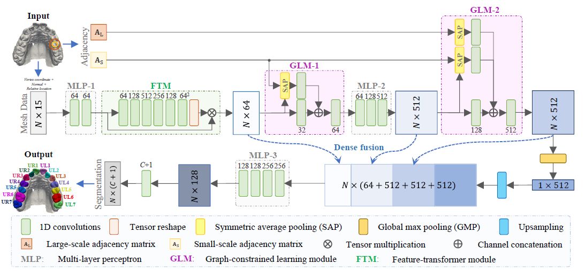

**MeshSegNet: Deep Multi-Scale Mesh Feature Learning for Automated Labeling of Raw Dental Surface from 3D Intraoral Scanners**
==============================================================================================================================

Created by [Chunfeng Lian](https://github.com/chunfenglian/), Li Wang,
[Tai-Hsien Wu](https://github.com/Tai-Hsien/Mesh_Label_Fixer.git), Fan Wang,
Pew-Thian Yap, Ching-Chang Ko, and Dinggang Shen

Introduction
------------

This work is the pytorch implementation of **MeshSegNet**, which has been
published in *IEEE Transactions on Medical Imaging*
(<https://ieeexplore.ieee.org/abstract/document/8984309>) and *MICCAI 2019*
(<https://link.springer.com/chapter/10.1007/978-3-030-32226-7_93>). MeshSegNet
is used to precisely labeling teeth on digitalized 3D dental surface models
acquired by Intraoral scanners (IOSs).

In this repository, there are three main python script (steps 1 to 3) and three
optional python script (steps 3-1, 4, and 5). Unfortunately, we are unable to
provide the data. Please see below for the detailed explanation of codes.

Step 1 Data Augmentation
------------------------

In order to increase the training dataset, we first augment the available
intraoral scans (i.e., meshes) by 1) random rotation, 2) random translation, and
3) random rescaling of each mesh in reasonable ranges.

In this work, our intraoral scans are stored as VTP (VTK polygonal data) format.
I have designed a customized simplified package called “*easy\_mesh\_vtk”* for
reading and manipulate VTP files. Please refer to
<https://github.com/Tai-Hsien/easy_mesh_vtk>. In our work, we have 36 intraoral
scans, and all of these scans have been downsampled by using “*easy\_mesh\_vtk”*
previously. We use 24 scans as the training set, 6 scans as the validation set,
and keep 6 scans as the test set. For training and validation sets, each scan
(e.g., Sample\_01\_d.vtp) and its flipped (e.g., Sample\_01001\_d.vtp) are augmented
20 times. All generated augmented intraoral scans (i.e., training and validation
sets) will be saved in “*./augmentation\_vtk\_data*” folder.

In *step1\_augmentation.py*, the variable *“vtk\_path”* needs to define, which is
the folder path of intraoral scans. Then you can implement this step by the
following command.

python step1\_augmentation.py

Step 2 Generate training and validation lists
---------------------------------------------

In *stpe2\_get\_list.py*, please define variables “*num\_augmentation*” and
“*num\_samples*” according to *step1\_augmentation.py.* Since we use 24 of 30
scans as training data, the “*train\_size*” is set to 0.8. You can implement this
step by the following command.

python step2\_get\_list.py

Then, two CSV files (i.e., train\_list.csv and val\_list.csv) are generated in the
same folder.

Step 3 Model training
---------------------

In *step3\_training.py*, please define variable “model\_name” used for
[visdom](https://github.com/facebookresearch/visdom) environment and output
filename. If your system doesn’t have
[visdom](https://github.com/facebookresearch/visdom), please set variable
“*use\_visdom*” as *False*. In this work, the number of classes is 15, second
molar to second molar (14 teeth) and gingiva. The number of features is 15,
corresponding to cell vertices (9 elements), cell normal vector (3 elements),
and the relative position (3 elements). To further augment our dataset, we
select all tooth cells (i.e., triangle) and randomly select some gingival cells
to form 6,000 cells inputs based on original scans in
“*./augmentation\_vtk\_data*” during training. To prepare the input features and
further augmented data as well as computing adjacent matrixes (AS and
AL, refer to the original paper for detail) are carried out by
*Mesh\_dataset.py*. The network architecture of **MeshSegNet** is defined in
*meshsegnet.py*.

You can start to train a **MeshSegNet** model by the following command.

python step3\_training.py

Optional:

If you would like to continue to train your previous model, you can modify
*step\_3\_1\_continous\_training.py* accordingly and execute it by

python step3\_1\_continous\_training.py

Step 4 Model testing
--------------------

Once you obtain a well-trained model, you can use *step4\_test.py* to test the
model using your test dataset. Please define the path of the test dataset
(variable “*mesh\_path*”) and filename according to your data. To implement, by
entering

python step4\_test.py

The deployed results will be saved in “*./test*” and metrics (DSC, SEN, PPV)
will be displayed.

Step 5 Predict unseen intraoral scans
-------------------------------------

*step5\_predict.py* is very similar to *step4\_test.py*. Once you set the data
path and filename accordingly, it can predict the tooth labeling on unseen
intraoral scans. The deployed results will be saved in “*./test*” as well. No
metrics will be computed because the unseen scans do not have ground truth.

To implement, by entering

python step5\_predict.py

Post-Processing
---------------

Our publication in *IEEE Transactions on Medical Imaging
(*<https://ieeexplore.ieee.org/abstract/document/8984309>) mentioned the
multi-label graph-cut method to refine the predicted results. We do not provide
the related code in this repository. However, we implement this step using the
MATLAB code [gco-v3.0.zip](http://mouse.cs.uwaterloo.ca/code/gco-v3.0.zip) at
<https://vision.cs.uwaterloo.ca/code/>. If you need help in this part, please
feel free to email me (<wu.5084@osu.edu>) or contact me via my github.

Citation
--------

If you find our work useful in your research, please cite:

\@article{Lian2020,
author = {Lian, C and Wang, L and Wu, T and Wang, F and Yap, P and Ko, C and
Shen, D},
doi = {10.1109/TMI.2020.2971730},
issn = {1558-254X VO -},
journal = {IEEE Transactions on Medical Imaging},
keywords = {3D Intraoral Scanners,3D Shape Segmentation,Automated Tooth
Labeling,Geometric Deep Learning,Orthodontic Treatment Planning},
mendeley-groups = {2020{\\_}ML in dentistry{\\_}Springer/Chapter 11},
pages = {1},
title = {{Deep Multi-Scale Mesh Feature Learning for Automated Labeling of Raw
Dental Surfaces from 3D Intraoral Scanners}},
year = {2020}
}

\@inproceedings{Lian2019,
address = {Cham},
author = {Lian, Chunfeng and Wang, Li and Wu, Tai-Hsien and Liu, Mingxia and
Dur{\\'{a}}n, Francisca and Ko, Ching-Chang and Shen, Dinggang},
booktitle = {MICCAI 2019},
editor = {Shen, Dinggang and Liu, Tianming and Peters, Terry M and Staib,
Lawrence H and Essert, Caroline and Zhou, Sean and Yap, Pew-Thian and Khan,
Ali},
isbn = {978-3-030-32226-7},
mendeley-groups = {2020{\\_}ML in dentistry{\\_}Springer/Chapter 11},
pages = {837--845},
publisher = {Springer International Publishing},
title = {{MeshSNet: Deep Multi-scale Mesh Feature Learning for End-to-End Tooth
Labeling on 3D Dental Surfaces BT - Medical Image Computing and Computer
Assisted Intervention – MICCAI 2019}},
year = {2019}

}
